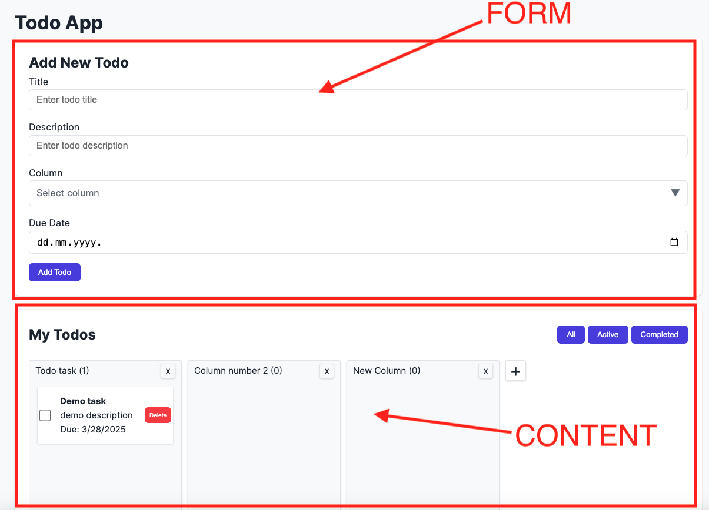

# Project documentation

The Todo app consists of two main parts: a form and a component for displaying tasks.

   

The form contains four input fields:
- The first one is required and represents the task title.
- The second one is optional and represents the task description.
- The third one is required and is a select option for choosing the column to which the task belongs.
- The fourth one is optional and represents the task's due date.

At the beginning of the content section, there is a heading "My Todos", which represents the title of this section, along with buttons for filtering tasks.

The filter contains three options:
- Displaying all tasks
- Displaying only active/incomplete tasks
- Displaying completed tasks

   

After that comes the section for displaying tasks. Tasks are grouped into columns. A column represents a collection of similar tasks.

## TASKS

- A task can be deleted by clicking the delete button.
- A task can be marked as completed by checking the checkbox.
- Additionally, a task can be moved to another column.

## COLUMNS

Columns have two options:

- A new column can be created by clicking the plus icon, entering a name in the text field, and confirming by clicking the check button or pressing Enter.

   

- A column can be deleted by clicking the "X" button. After clicking, a popup window will appear with the message:

The user can choose to either delete all tasks or move them to another column.

At least one column must exist at all times. If there is only one column, it cannot be deleted. When the application is first used, a default column named 'Todo Task' is available.