# Project documentation

The Todo app consists of two pages: form page, and canban page.

## Form page
The purpose of this page is to add new tasks.
The fields that make up the form are:
- title (requred)
- description (not required)
- column (required)
- date (not required)

<br />

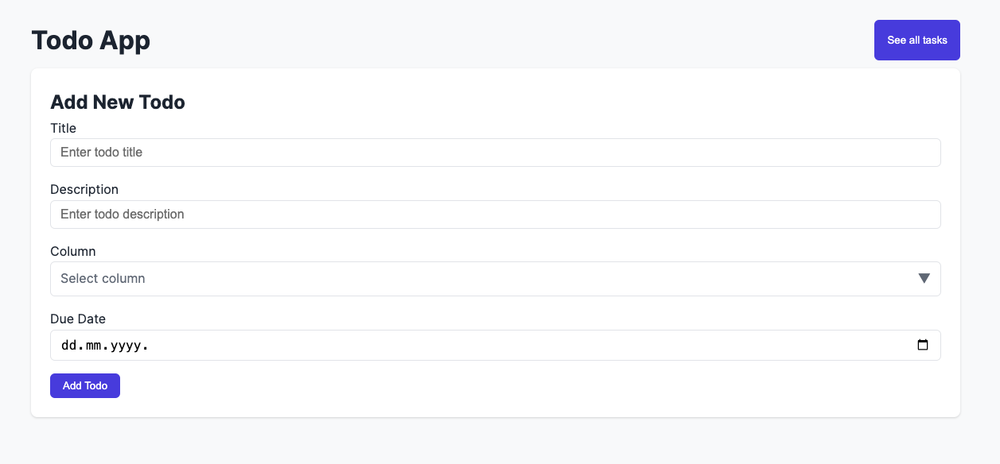

In case of a successful addition, a message will appear: 
```
"New task successfully added!"
```
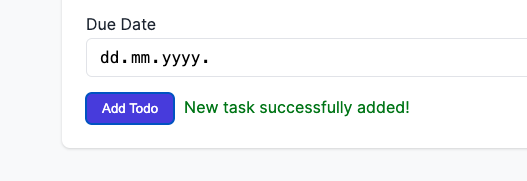

In case of not filling in the required fields, the border of those fields will turn red.

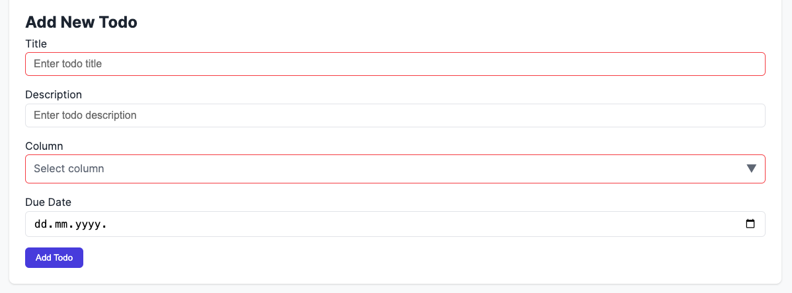

If you want to navigate to another page, i.e., to view the tasks, you can click the "See all tasks" button in the top right corner.

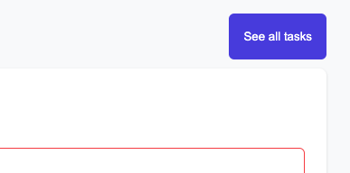

<br />
<br />


## Canban page

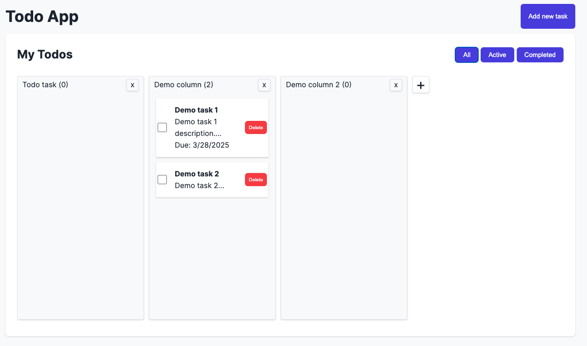

The purpose of this page is to display columns and tasks. A task is an individual todo that was previously added, and a column represents a group of tasks that share something in common.

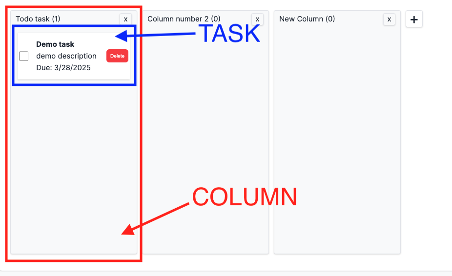

At the beginning of the content section (right top), there is a heading "My Todos", which represents the title of this section, along with buttons for filtering tasks.

The filter contains three options:
- Displaying all tasks
- Displaying only active/incomplete tasks
- Displaying completed tasks


<br />

If you want to add a new task, you must go to the tasks page at the path "/". You can do this by clicking the "add new task" button.

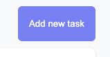

<br />

## TASKS

- A task can be deleted by clicking the delete button.
- A task can be marked as completed by checking the checkbox.
- Additionally, a task can be moved to another column. (drag and drop)

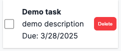
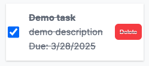

<br />

## COLUMNS

Columns have two options: add and delete column

- A new column can be created by clicking the plus icon, entering a name in the text field, and confirming by clicking the check button or pressing Enter.

<br />

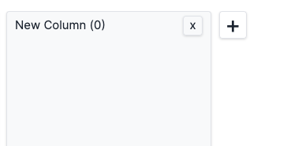
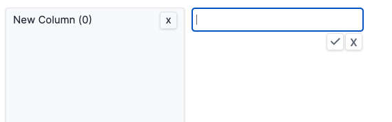

<br /> 

- A column can be deleted by clicking the "X" button. After clicking, a popup window will appear with the message:

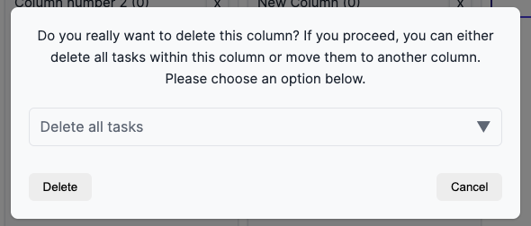

The user can choose to either delete all tasks or move them to another column.

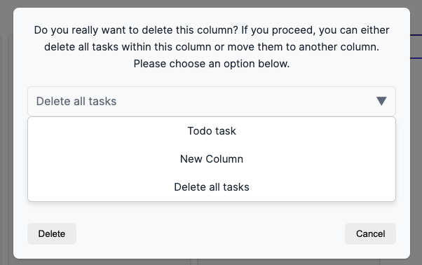

At least one column must exist at all times. If there is only one column, it cannot be deleted. When the application is first used, a default column named 'Todo Task' is available.